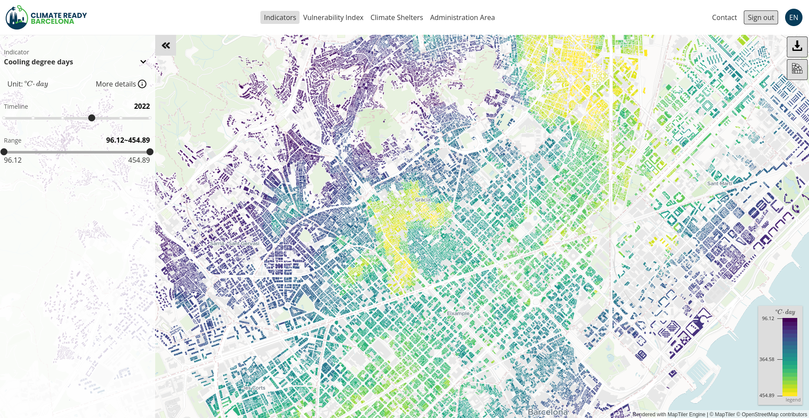
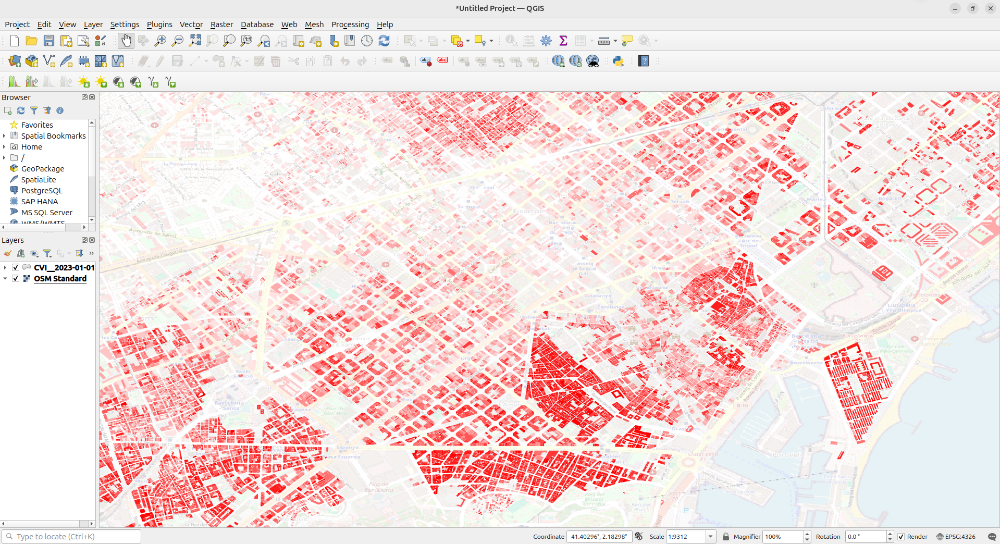

# Climate Ready Barcelona: User Interface Tutorial

Welcome to this tutorial on how to use [**Barcelona's Climate Vulnerability Map to Heat**](https://maps.climatereadybcn.eu), available at [maps.climatereadybcn.eu](https://maps.climatereadybcn.eu). This tool was developed within the framework of the [Climate Ready Barcelona](https://www.climatereadybcn.eu) project, funded by the [ICLEI Action Fund 2.0](https://iclei-europe.org/funding-opportunities/action-fund/).

The project was coordinated by [ECOSERVEIS](https://www.ecoserveis.net/en), and the map was primarily designed and implemented by [CIMNE](https://www.cimne.com) to support public authorities, researchers, and third-sector organizations in understanding heat-related vulnerability across the city.

Other partners involved in the project include [ABD](https://abd.ong/en/), [Bitgenoma](https://bitgenoma.com/en_US/page/homepage), and the [Barcelona City Council](https://ajuntament.barcelona.cat/en/).

⚠️ **Important Note:**  
This tutorial is a **demonstration of the functionalities and capabilities** of the web-based map. The source code of the platform **cannot be shared**, as it is built on **MapFrame**, a proprietary framework developed by **[NAZKA Mapps](https://nazka.be)**. MapFrame is not open source and is subject to its own licensing terms.

Despite this limitation, the tutorial aims to guide users through the main features and analytical layers of the platform, helping to make the most out of this powerful visualization and decision-support tool.

---

## 🔐 User Log In / Sign Up

Access to the map is currently **restricted** to authorized users. To use the platform:

1. Go to [maps.climatereadybcn.eu](https://maps.climatereadybcn.eu).

    

        
    

    
<i>Figure 1. Initial view of the Climate Ready Barcelona web application</i>

2. Click the *Sign in* button on the homepage and follow the steps based on your credential status:

    2.1. **If you already have an account**, enter your credentials in the appropriate fields and click the *Sign in* button.

    2.2. **If you have an account but have forgotten your password**, use the *Recover password* option to reset it. You will be asked to provide the email address associated with your account.

    

    
<i>
        
        Figure 2. Enter your registered email address to receive a password recovery link
        
    </i>

    2.3. **If you do not yet have an account**, click the *Sign up* button, complete the registration form, and submit your request. Account approvals are handled manually on a daily basis. Once validated, you will receive an email allowing you to set your password. 

    

    
<i>Figure 3. Complete the registration form and click Request</i>

> 🔒 *Note: As of June 2025, access is limited to technicians from the Barcelona City Council or affiliated entities.*

---

## 🧭 Navigation Guide

Once logged in, you’ll be able to explore the interactive map. Here's a quick overview of how to navigate:

<i>Figure 4. First visualisation of the map</i>

- **Zoom In/Out**: Use your mouse wheel to zoom in or out of the map.
- **Pan**: Click and hold the left mouse button to drag and navigate around the map.
- **Language Selection**: Click the blue button at the top right corner of the website to change the language. English, Spanish, and Catalan are available.
- **Top Panel**: Use this menu to select the functionality you wish to explore:
  - *Indicators*: Visualize real, simulated, or predicted values of various indicators related to building characteristics, historical climate conditions, demography, socioeconomics, energy, and available infrastructure.
  - *Vulnerability Index*: Display estimated vulnerability indices across the city. *(As of June 2025, only climate vulnerability due to heat is available.)*
  - *Climate Shelters*: View the locations of designated climate shelters in the city and the shelter at minimum distance to each building. You can filter them by opening hours, characteristics, and building type.
- **Left Panel**: Contains selectors, filters, and metadata for the selected variable.
- **Right Side Buttons**: Provide options for downloading datasets, selecting legends, changing background maps, and toggling data visualization.
- **Right Side Legend**: Displays the color-coded scale for the map, including units, minimum and maximum values, and mid-range values depending on the selected indicator and the type of legend selected.

---

## 🗂️  Tab Explanations

The interface is divided into three tabs, each one providing access to different functionalities:

### 📍 Indicators

This tab allows you to toggle and explore multiple indicators related to building characteristics, historical climate conditions, demography, socioeconomics, energy, and available infrastructure.

#### Metadata details

In the first panel dialog, the dropdown menu allows users to select one of the available indicators. In the second section, the variable’s unit is displayed using LaTeX formatting. Additionally, there is a "More details" button that opens a modal with a description of the selected indicator and the data sources used to calculate or estimate it.
   

   
<i>Figure 5. Metadata details in the indicators tab</i>

#### Timeline slider
In the third section of the panel, a timeline slider allows users to explore the indicator across different years. By default, the latest year with available data is selected. Some indicators, however, are only available for a single year.
   

   
<i>Figure 6. Timeline in the indicators tab</i>

#### Range slider
In the fourth section of the panel, a range slider allows users to limit the items depicted in the map based on its values.
   

   
<i>Figure 7. The range slider can be used to filter the indicator values over the map</i>

#### Layer selector 
The fifth section is optional and only appears for certain indicators. When available, it provides a list of selectable layers accessed through one of the labeled buttons.
   

   
<i>Figure 8. Multi-layer indicators</i>

#### Building detail
Selecting one of the buildings through the map, opens a dialog where exhibits the cadastral parcel number and the value of the indicator for that building.
   

   
<i>Figure 9. </i>

Furthermore, if you click over Building details, a modal will be opened containing all the indicators for that building.
   
 

   
 

   
 

   
<i>Figure 10. All the indicators available for one building</i>

#### Download actual layer
The indicator depicted over the map is available for downloading clicking the first button from the right-top of the map. A modal will be opened that allows downloading a GeoJSON containing the geographical layer and the data layer. Also the JSON containing the metadata of the indicator can be downloaded.
   

   
<i>Figure 11. Downloading dialog</i>

   
 

   
<i>Figure 12. An example GeoJSON file downloaded from our web opened in QGIS and an example of the JSON file containing the metadata</i>

#### Legend colouring distribution method
The legend can be set to either linear or quantile mode using the second button from the top. In the linear mode, the colour scale is evenly distributed between the minimum and maximum values of the indicator. In the quantile mode, the colour scale is based on the statistical distribution of the data, so the midpoint corresponds to the 50th percentile (median) of the indicator values.

 

 
 

<i>Figure 13. Types of legend colouring distribution (quantile on the left, linear on the right)</i>

#### Change of background layers
The third button from the top allows to vary the background map between three types: basic (default), detailed and satellite. Finally, with the fourth button from the top, the coloured polygons can be turn to invisible if the user wants to focus uniquely on the background map.
   

   
 

   
 

   
 

   
<i>Figure 14. Different types of background map</i>

### 📊 Climate Vulnerability Index tab
In the second tab of the website, accessible from the top bar, climate vulnerability indexes are displayed on a map. Currently, the only available index is the vulnerability map to heat.

 

<i>Figure 15. Visualisation of the heat vulnerability map</i>

In this tab, in addition to functionalities similar to those in the indicators tab, users can customize the weights assigned to each indicator group. This allows for a more tailored representation based on different sensitivities or user preferences.

 
 

<i>Figure 16. Two additional examples of the heat vulnerability map with modified indicator weights</i>

### 📊 Climate Shelters tab
In the third tab of the website, users can explore the availability of climate shelters based on a set of predefined characteristics—such as access to drinking water, accessible restrooms, and pet allowance—as well as their opening hours and typology (e.g., libraries, swimming pools, parks). The filtering logic across the different sections applies an AND operator. The map is colour-coded to represent the walking time (in minutes) to the nearest climate shelter, calculated using isochrone maps with a maximum walking distance of 30 minutes.

In the left panel, the first section allows users to specify a date and time to filter shelters according to their official opening schedules throughout the year.

 
<i>Figure 17. Filtering climate shelters by date and time</i>

In the second section, users can select the required characteristics using checkboxes.
The third section enables users to choose the type of building or built environment associated with the shelter. All selected filters across these sections are combined using an AND logic.

<i>Figure 18. Filtering by shelter characteristics and typology</i>

Clicking on a black dot on the map displays a detailed modal with comprehensive information about the selected climate shelter. Upon selection, the shelter’s marker changes to red.

<i>Figure 19. Shelter information modal and marker highlighting</i>

Additionally, clicking on a building highlights its proximity to the nearest climate shelter. The estimated walking time (in minutes) is shown, and the corresponding shelter is marked in red on the map.

<i>Figure 20. Display of walking time to the nearest shelter from a selected building</i>

---

## ✅ Conclusions

The Climate Vulnerability Map to Heat is designed to support **climate adaptation planning**, **urban design**, and **public health strategies** by offering spatialized, integrative data on how heat impacts Barcelona’s population.

Although the underlying software for the UI is proprietary and not publicly available, this tutorial offers a detailed walk-through to help users understand and apply the platform’s functionalities.

We encourage you to explore the different layers, combine datasets, and use the insights provided to support evidence-based decision making.

---

## 📣 Help Us Improve!

We’d love to hear your feedback! Please take a moment to fill out this short survey (in Catalan):

👉 [https://forms.gle/zHTL3sjiyEaDib3a9](https://forms.gle/zHTL3sjiyEaDib3a9)

Your input helps us improve the platform and tailor it to your needs. Thank you!

---
